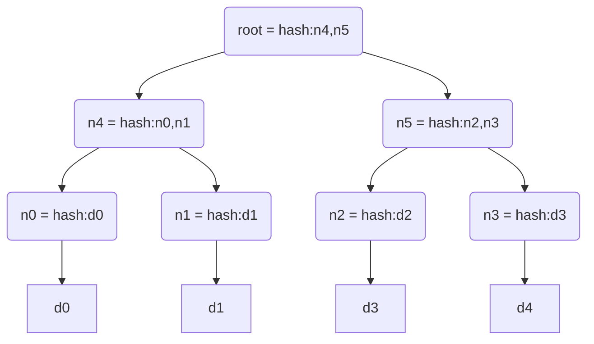

# 哈希树

## 概念

哈希树（hash tree；Merkle tree），由瑞夫·墨克于 1979 年申请专利，故亦称墨克树（Merkle tree）。
在密码学及计算机科学中是一种树形数据结构，每个叶节点均以数据块的哈希作为标签，
而除了叶节点以外的节点则以其子节点标签的加密哈希作为标签 。

哈希树能够高效、安全地验证大型数据结构的内容，是[哈希链](./散列链.MD)的推广形式。

## 定义、性质及实现

哈希树是一种典型的二叉树结构，由根节点、一组中间节点和一组叶节点组成。

其主要特点为：

* 最下面的叶节点包含存储数据或其哈希值；
* 非叶子节点（包括中间节点和根节点）都是它的两个孩子节点内容的哈希值。

进一步，默克尔树可以推广到多叉树的情形，此时非叶子节点的内容为它所有的孩子节点的内容的哈希值。

哈希树逐层记录哈希值的特点，让它具有了一些独特的性质。例如，底层数据的任何变动，都会传递到其父节点，一层层沿着路径一直到树根。
这意味树根的值实际上代表了对底层所有数据的“数字摘要”。

其主要特点为：

最下面的叶节点包含存储数据或其哈希值；
非叶子节点（包括中间节点和根节点）都是它的两个孩子节点内容的哈希值。
进一步地，默克尔树可以推广到多叉树的情形，此时非叶子节点的内容为它所有的孩子节点的内容的哈希值。

大多数哈希树实现都是二叉树，也可多叉。

哈希树中哈希值的求取通常使用如 SHA-2 的加密哈希函数，但若只防止非故意的数据损坏，也可用不安全的校验，比如CRC。

### 常见Merkle Tree

* Balanced Merkle Tree是所有Block数据只存储在叶子节点，且所有叶子到根距离相等的一种Merkle Tree。
* IPFS存储（分布式存储）会将文件切割为Block并将这些Block构建为一棵Merkle Tree存储。IPFS实现了两种Merkle Tree：
    * Balanced Merkle Tree
    * Trickle Merkle Tree

## 应用

哈希树可验证计算机内部和计算机之间存储、处理和传输的任何类型的数据。 可确保从 P2P 网络中的其他节点接收到的数据块未损坏、未更改，可以检查其他节点是否发送假块。

哈希树用于基于哈希的密码学场景。此外还有很多应用场景，如：

* 文件系统，如星际文件系统 (IPFS)、Btrfs 和 ZFS 文件系统，可对抗数据退化。
* Dat protocol。
* Apache Wave protocol。
* Git 和 Mercurial 分布式版本控制系统。
* Tahoe-LAFS 备份系统。
* Zeronet。
* 比特币和以太坊对等网络。
* 证书透明度框架。
* Nix 包管理器以及其后代如 GNU Guix。
* NoSQL 系统，如 Apache Cassandra、Riak 和 Dynamo。

有人建议在可信计算系统中使用散列树。
最初的比特币 Merkle 树实现过度应用哈希函数的压缩步骤，使用 Fast Merkle Trees 可以缓解这种情况。

### 证明某个集合中存在或不存在某个元素

通过构建集合的默克尔树，并提供该元素各级兄弟节点中的 Hash 值，可以不暴露集合完整内容而证明某元素存在。

另外，对于可以进行排序的集合，可以将不存在元素的位置用空值代替，以此构建稀疏默克尔树（Sparse Merkle Tree）。
该结构可以证明某个集合中不包括指定元素。

### 快速比较大量数据

对每组数据排序后构建默克尔树结构。当两个默克尔树根相同时，则意味着所代表的两组数据必然相同。否则，必然不同。

由于 Hash 计算的过程可以十分快速，预处理可以在短时间内完成。利用默克尔树结构能带来巨大的比较性能优势。

### 快速定位修改

以下图为例，基于数据 D0……D3 构造哈希树，如果 D1 中数据被修改，会影响到 N1，N4 和 Root。

一旦发现某个节点如 Root 的数值发生变化，沿着 Root --> N4 --> N1，最多通过 O(lgN) 时间即可快速定位到实际发生改变的数据块
D1。

### 零知识证明

仍以上图为例，如何向他人证明拥有某个数据 D0 而不暴露其它信息。挑战者提供随机数据 D1，D2 和 D3，或由证明人生成（需要加入特定信息避免被人复用证明过程）。

证明人构造如图所示的默克尔树，公布 N1，N5，Root。验证者自行计算 Root 值，验证是否跟提供值一致，即可很容易检测 D0 存在。
整个过程中验证者无法获知与 D0 相关的额外信息。

### p2p下载

* 通常先从可信的来源获取顶部哈希，如朋友告知、网站分享等。
* 得到顶部哈希后，则整棵哈希树就可以通过 P2P 网络中的非受信来源获取。
* 下载得到哈希树后，即可根据可信的顶部哈希对其进行校验，验证是否完整未破坏。
* 如果哈希树损坏或伪造，则将尝试来自另一个来源的另一棵哈希树，
* 直到程序找到与顶部哈希匹配的哈希树。

详见：
[分布式和存储的那些事](https://zhuanlan.zhihu.com/p/137881105)、
[哈希树简介](https://blog.csdn.net/K346K346/article/details/129815415?ops_request_misc=%257B%2522request%255Fid%2522%253A%2522169495968716800180626794%2522%252C%2522scm%2522%253A%252220140713.130102334..%2522%257D&request_id=169495968716800180626794&biz_id=0&utm_medium=distribute.pc_search_result.none-task-blog-2~all~top_click~default-1-129815415-null-null.142^v94^insert_down28v1&utm_term=%E5%93%88%E5%B8%8C%E6%A0%91&spm=1018.2226.3001.4187)
